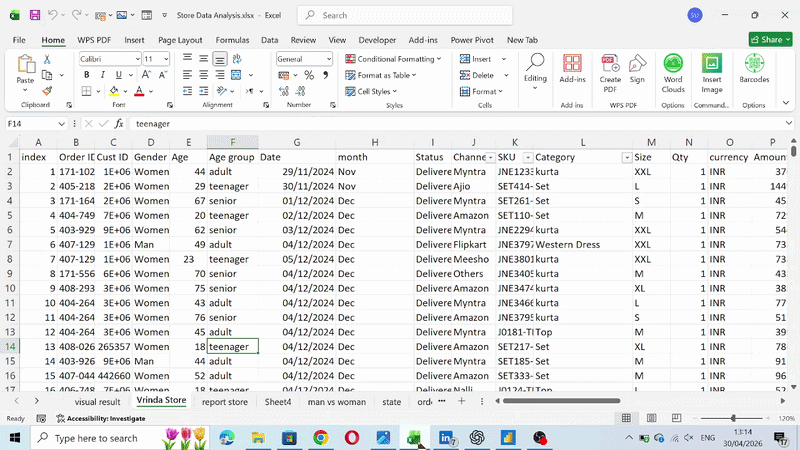

📊 Excel Sales Dashboard
## 📊 Dashboard Preview

2026-04-3013-14-26-ezgif.com-video-to-gif-converter.gif
Overview

An interactive Excel dashboard built using Pivot Tables and charts to analyze sales performance, customer demographics, order status, and revenue trends.

(1):  Tools & Skills

Microsoft Excel

Pivot Tables & Pivot Charts

Slicers & Filters

Data Visualization

Business Analysis

(2):  Key Insights

Monthly sales trend analysis

Order status breakdown (Delivered, Cancelled, Returned, Refunded)

Customer distribution by gender and age group

Top-performing states and sales channels

(3):  Features

Interactive slicers (Month, Status, Channel)

Clean, professional dashboard layout

Easy-to-understand visual insights

(4):  Goal

Demonstrates practical Excel and data analysis skills for entry-level Data Analyst / Business Analyst roles.
